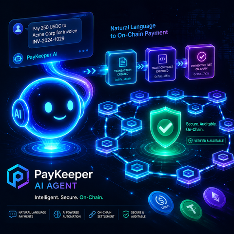

# PayKeeper · 项目愿景（Project Vision）



> **一句话**：用一句自然语言，让 AI Agent 经 KeeperHub 在链上自动完成付款、订阅与按次付费——每一步都可审计。

---

## 一、我们的信念

Web3 不应该是"懂命令行的人"的特权。每一次链上动作——付款、订阅、按次付费——都不应该要求用户拼 JSON、盯回执、防双付、与 gas 较劲。**链上支付应该像发一条微信一样简单，但比银行转账更安全。**

PayKeeper 相信：**自然语言是人类与链上世界之间最短的距离**，而真正的安全与可审计性，正是这条最短距离的护栏。

---

## 二、我们解决什么问题

链上支付对绝大多数人仍然"工程化"得离谱：

| 痛点 | 真实代价 |
|------|----------|
| 要选工具、拼参数、盯回执 | 一个简单订阅要花数小时调试 |
| 提示词注入就能让 Agent 转账 | AI × Web3 安全的核心焦虑 |
| 同一笔交易重试就扣两次 | "幂等键" 成了开发者的黑话 |
| 主网 / 测试网 / L2 切换踩坑 | 一次误操作 = 真实资金风险 |
| 没有"先模拟再执行"的护栏 | 错的广播 = 浪费的 gas |
| 可审计性依赖中心化日志 | 失去 Web3 的初心 |

**PayKeeper 把这一切变成一句话**。Agent 负责解析意图、匹配风控规则、经 KeeperHub 预飞、幂等广播、轮询确认、输出可审计报告——钱真的在链上动了，但用户全程只说人话。

---

## 三、我们的解决方案

```
用户自然语言（如"每月 1 号付 5 USDC"）
        │
        ▼
┌─────────────────────────────────────────────────────┐
│  LangGraph ReAct Agent · 9 个 LLM provider 可切换    │
│  (Anthropic / OpenAI / DeepSeek / OpenRouter / …)   │
└────────────────────────┬────────────────────────────┘
                         │  MCP (Streamable HTTP)
                         ▼
┌─────────────────────────────────────────────────────┐
│  KeeperHub 执行层                                    │
│  • MCP Server (35 tools)  • x402 按次付费            │
│  • Workflow Builder      • Audit Trail              │
│  • Gas Sponsorship       • Turnkey Wallet           │
└────────────────────────┬────────────────────────────┘
                         │  EVM
                         ▼
              Sepolia / Base / Mainnet
```

### 三大安全护栏（让"一句话"不等于"裸奔"）

1. **自然语言即支付指令** — 不需要懂 MCP 工具、不需要拼 JSON 参数
2. **钱的安全边界** — 白名单 / 单笔限额 / 每日累计限额（fail-closed）
3. **可审计、可重试、防双付** — 幂等键一次生成全程复用，重试绝不重复扣款

---

## 四、关键价值主张

### 对开发者
- 9 个 LLM provider 一行切换，无需硬编码模型
- 一键 `python examples/full_demo.py` 跑通真实链上交易
- 端到端文档 + 教程 + 演示脚本，开箱即用

### 对最终用户
- "每周五给 `0x…` 转 0.01 ETH，日限额 0.05"——一句话搞定
- 真定时器订阅、按次付费、批量结算，一次到位
- 完整审计轨迹，每一步都可查

### 对生态
- 展示 Web3 + AI Agent 的正确集成范式
- 沉淀可复用的 MCP 客户端、x402 实现、订阅调度器
- 推广"先模拟、再风控、再幂等、再广播"的可靠性范式

---

## 五、适用场景

| 场景 | PayKeeper 的角色 |
|------|------------------|
| DAO 财库自动发薪 | Agent 按规则执行多签付款，自动审计 |
| DeFi 自动化订阅 | VPN/SaaS 代付，无需人工续费 |
| AI Agent 间 micropayment | x402 按次付费，无需预付手续费 |
| 电商自动结算 | 批量付款 + 每日限额 + 实时审计 |
| 个人理财助手 | "余额低于 0.5 ETH 自动补足到 1 ETH" |

---

## 六、长期愿景

> **让每一笔链上支付都像发短信一样简单，同时比银行转账更安全。**

我们希望 PayKeeper 成为 **AI Agent × Web3 支付** 的事实标准基础设施：

- **短期（已实现）**：自然语言驱动 + KeeperHub 执行层 + 三层风控 + 46 项测试 + 10 笔真实链上交易
- **中期（路线图）**：多链扩展（Solana / Aptos）、Agent 间协作市场、可组合的支付策略 DSL、企业级 SSO
- **长期**：与 KeeperHub 生态深度融合，让"一句话付款"成为下一代 Web3 应用的默认交互范式

---

## 七、社区与贡献

PayKeeper 是 MIT 开源项目，欢迎：
- ⭐ Star & Watch 关注进展
- 🐛 提 Issue 报告问题
- 🔧 提 PR 贡献代码（参见 `docs/TUTORIAL.md` 与 `docs/ONBOARDING_TEARDOWN.md`）
- 📢 在你的项目中使用 PayKeeper

## 八、致谢

- [KeeperHub](https://app.keeperhub.com) — MCP / x402 / 审计 / 钱包基础设施
- [LangChain / LangGraph](https://www.langchain.com) — ReAct Agent 框架
- [DeepSeek](https://platform.deepseek.com) — 默认 LLM，OpenAI 兼容 API

---

<div align="center">

**PayKeeper — Intelligent. Secure. On-Chain.**

*Build · Audit · Iterate · Trust*

</div>